# Nile Tilapia Disease Detection Using Deep Learning

Floris van Rijn

MSc in Computer Science

The University of Bath

2023

> This dissertation may be made available for consultation within the University Library and may be photocopied or lent to other libraries for the purposes of consultation.

**Software**

To access the dataset used in the training of the convolutional neural networks as well as all the trained weights of the neural networks and the 3D models you can navigate to this Kaggle private repository. The link will allow anyone access.

<https://kaggle.com/datasets/a7372f357af9e3faaaf8df6b83e94cd0664a081fe912e782c217a100e03d7a95>

The best performing model of self-trained and transfer learning are provided in the Engage upload.

**Copyright**

Attention is drawn to the fact that copyright of this dissertation rests with its author. The Intellectual Property Rights of the products produced as part of the project belong to the author unless otherwise specified below, in accordance with the University of Bath's policy on intellectual property (see

[<u>https://www.bath.ac.uk/publications/university-ordinances/attachments/Ordinances_1_October_2020.pdf</u>](https://www.bath.ac.uk/publications/university-ordinances/attachments/Ordinances_1_October_2020.pdf)).

This copy of the dissertation has been supplied on condition that anyone who consults it is understood to recognise that its copyright rests with its author and that no quotation from the dissertation and no information derived from it may be published without the prior written consent of the author.

**Declaration**

This dissertation is submitted to the University of Bath in accordance with the requirements of the degree of MSc Computer science in the Department of Computer Science. No portion of the work in this dissertation has been submitted in support of an application for any other degree or qualification of this or any other university or institution of learning. Except where specifically acknowledged, it is the work of the author.

**Abstract**

This paper builds a deep learning disease identification algorithm for the Nile tilapia fish with a focus on Streptococcosis and Tilapia Lake Virus (TiLV). These diseases have a high mortality rate with their global annual cost ranging in the tens to hundreds of millions of dollars in lost production. There is a stigma attached for a farm to admit to having diseases as this can lead to economic losses. Therefore, to collect data on sick fish, this paper 3D models, 3D prints and then hand-paints sick Nile tilapia models. These models are used in a Swedish Nile tilapia farm to collect data. The collected dataset is used to train deep learning algorithms optimising hyperparameter choice. This paper’s main contribution is an algorithm that can help farmers eliminate the error prone manual process of disease identification in place for an automated and robust deep learning algorithm. The algorithm can correctly identify physical symptoms of Streptococcosis and TiLV with 99.67% accuracy in the collected data. Further contributions include a newly available extensive dataset on red strain Nile tilapia and 3D models of Nile tilapia in all stages of their life.

## Acknowledgements

I am deeply grateful to the following individuals and organisations who played pivotal roles in supporting me to complete this research.

My supervisor, Dr. Hongping Cai. I extend my heartfelt appreciation for your support and invaluable insights which have been instrumental in shaping my research and driving my work.

The University of Bath. I am grateful for being granted the opportunity to pursue my Master’s in Computer Science which has been a long-term dream.

Gårdsfisk. I am thankful to the whole company for welcoming me in their facilities and making me feel like one of the team. Without this opportunity for data collection my research would not have been possible. I would like to extend a special thanks to both Pauline Le Berre and Cyril Barbier. For both of you, your knowledge and passion for the industry coupled with your patience and kindness made for an inspiring visit.

My brother Alexander, and mother. I am deeply thankful for your unwavering support over the duration of my entire degree. Two acts that stand out are the number of times you adjusted your schedules around mine and for your continuous check-ins that kept me progressing.

My father. I am thankful for your desire to learn about new technologies and ask questions that helped further my thinking on my topic.

My partner, Fiona <u>Hübner</u>. Thank you from bottom of my heart for your support throughout this entire journey. The evenings and weekends you spent working alongside me turned the most difficult moments into fond memories.

My friends, Aonghus Ó Cochláin and Liam Murphy. Thank you for providing me a platform to discuss my thoughts and for furthering my learning through critical questions.

Victor Denoncin. Thank you for the detailed craftmanship you showed in creating the 3D models.

Nimrod Breger. Thank you for opening your home for painting sessions and sharing your knowledge and equipment to allow me to produce models to a high standard.

Alexander Brouwer and Jamie Morton. Thank you for readily making your 3D printers accessible and printing all the models used in this thesis.

In addition, I want to acknowledge the countless individuals who have crossed my path, offering advice, encouragement, and wisdom. I am grateful to be standing on the shoulders of giants.

With sincere gratitude,

Floris van Rijn

## 1. Introduction 

The Nile tilapia is the world’s second most cultivated freshwater fish. It has more than doubled its share in the global aquaculture production in the span of just 20 years making up 5.27% in 2018, up from 2.38% in 1998. The global Nile tilapia market is estimated at 11.2 billion US dollars annually with 9% significant growth observed year over year between 2017 and 2019 (Asian fisheries society 2019, FAO Fishery and Aquaculture statistics 2019). Fast growth, tolerance to a wide range of salinity, dissolved oxygen and temperature, as well as an ease of reproduction and omnivorous feeding habit are key attributes to the Nile tilapia’s popularity as an aquaculture species (Francalossi and Turchini 2022). Over the course of more than twenty years of cultivation the Nile tilapia has grown to become the cornerstone of economic production in several countries including Egypt, China and Thailand. In Egypt the Nile Tilapia alone has resulted in the employment of 580,000 people[^1]. Major shocks to the aquaculture ecosystem can therefore have significant knock-on effects cascading through a country’s economy.

The Nile tilapia was considered relatively disease-free for more than twenty years, even when farmed in extreme conditions. However, from the summer of 2009 unidentified mass mortality events took place in Israel, Egypt and other high production countries. In the summer of 2015 across Egypt, 37% of fish farms in the three largest Egyptian aquaculture governorates (Kafr El Sheikh, Beheira and Sharqia) experienced mortality rates of 9.2% with economic impact reaching more than \$100 million. This was one of the largest of multiple major events also seen in Israel, China and Ghana that made headline news related to the disease, since named Tilapia Lake Virus (TiLV). The highly contagious pathogen has been reported in 16 countries (Surachetpong et al 2020) and continues to grow. In 2020 there was no commercially available vaccine. Surachetpong et al identify four fundamental areas of TiLV research needing to be addressed, two of which are the development of vaccines and antiviral therapies, and the development of diagnostic tools including field applicable diagnostics.

In the last two years multiple vaccines have been created using several methodologies including VP20 based, heat-killed vaccine (HKV), formalin-killed vaccine (FKV) and DNA based. At the same time there has only been marginal improvement in the rapid detection methodologies used in lab environments with the introduction of RT-PCR assays. Little development has taken place to rapidly identify the presence of the disease within farms on live fish.

Though vaccines have shown a strong efficacy, there is still a mounting pressure for improved field applicable diagnostics. This is because it is not always economically viable to utilise vaccines in large quantities as a preventative measure on Nile tilapia. This comes in part due to the low profit margins on Nile tilapia farming. Kaliba et al (2006) analyse the production costs of a farm in Tanzania finding in 300 rearing days, under ideal conditions of all male hand sexed Nile tilapia a maximum profit of EUR 19,50 (approximately 23% profit margins) was made on around 54 kg of farmed tilapia. The study also establishes the presence of price volatility for both inputs and outputs of farming, finding the gross profit margins in average farms (without all male sexed Tilapia) of 150m2 pond to be 2%, and 4% for a 300m2 pond.

Further considerations in the production of a solution can be taken from the Asian Fisheries Society which reported in 2018 that, of the more than six million tons of tilapia that had been produced that year, only 8% of production was exported. This report highlights the role tilapia plays in societies where the fish is predominantly bred for local consumption. Local food safety regulation tends to be less stringent than in the international market. At the same time pressure is mounting for stronger grade production due to the increase per unit price which has grown from 1.27 USD/kg in 1997 to 2.17 USD/kg in 2017. An affordable and accessible solution to rapid disease identification is needed to allow farmers to produce export grade tilapia as well as avoid economic impact from disease.

TiLV’s physical symptoms as identified by Australia’s department of agriculture include changes in body colour (darkening or lightening), skin erosion, haemorrhagic dermal lesions, scale protrusion, exophthalmos (popeye), opacity of the eye lens (cataract) and abdominal distension. Streptococcosis, which itself leads to more than \$150 million damages yearly in the Nile tilapia market shares a significant number of physical symptoms with TiLV including: pop-eye, anorexia, abdominal distention, darkening of the skin and haemorrhaging skin around the base of the fins. Streptococcosis also lacks a solution for rapid field diagnostics and can be combined easily with TiLV identification to form a wider ranging solution with larger impact.

### 1.1 Objectives

The main objectives of this paper can be summarised as:

1.  3D model, 3D print and paint realistic sick Nile tilapia models

2.  Train deep learning algorithms to detect TiLV and Streptococcosis in Nile Tilapia

3.  Make design decisions that will allow the solution to function in remote parts of the world with limited hardware and internet speeds

The rest of this paper will be structured as follows: section 2 gives an overview of existing research highlighting the gaps which will be filled in by this thesis, section 3 describes the process of data collection and augmentation, section 4 covers the methodology used to tackle the problem statement, section 5 provides the results and discusses them, highlighting future areas of focus and section 6 concludes.

## 2. Literature review

### 2.1 Disease research 

El-Sayed (2019) in their comprehensive book titled Tilapia Culture provides, as one of the top five reasons for the introduction of the tilapia in developing countries, their resistance to stress and disease. Since the 1950s tilapia farming has spread to more than 130 countries, and has been farmed in various waters, temperatures and intensities. This expansion and intensification of cultivation has made the tilapia more vulnerable to stress and disease outbreaks which have led to significant economic losses through mortality.

#### 2.1.1 Streptococcosis

Streptococcosis is a bacterial disease caused by the nonmotile bacteria Streptococcus sp. Klesius et al (2008) estimate the economic year loss due to the disease to be in the range of 250 million US dollars. Chen et al (2012) found it had caused a 40 million US dollar impact in the tilapia industry in China for the year 2011 alone. Bunch and Bejerano (1997) find that the bacteria is opportunistic and requires stress to assert pathogenicity. These findings give weight to the importance in finding a non-invasive solution that doesn’t contribute to increased stress in the tilapia such as through handling. This is further marked by findings from Getchell (1998) who find Streptococcus iniae transmitting from fish to humans possibly through open wounds.

Kayansamruaj et al (2014) mention that stressful culture conditions can arise from several factors including: low or high-water temperatures, high salinity, low dissolved oxygen, high nitrite and ammonia concentration, high stocking density and a high alkalinity of water where pH is above 8. All of which lead to higher susceptibility of tilapia to catch the bacterial streptococcosis.

Darwish and Griffin (2002) find that symptoms of fish infected by the bacteria include haemorrhage, hyperaemic gills, diffused epithelial tissue proliferation, lesions, exophthalmia (eye popping), dark colouration, abscess, erratic swimming, losing appetite, abdominal distension and lethargy. The major symptoms found in reported outbreaks include dark colouration, eye opacity, exophthalmia, erratic swimming and lethargy. Figure 1. Showcases several common clinical signs.

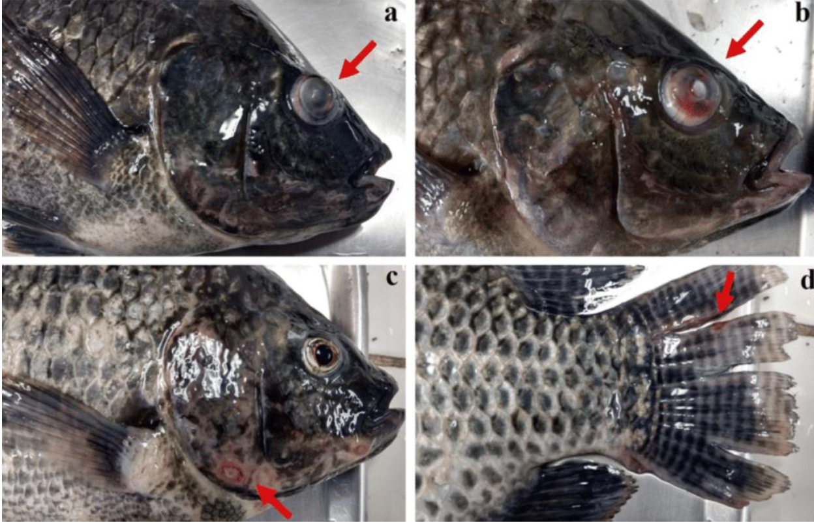

***Figure 1:** Bolaños et al (2021) showing the clinical signs compatible with streptococcosis including a, b Exophthalmia (eye popping), c Haemorrhagic lesions on the skin and d lesions and haemorrhages on fins.*

#### 2.1.2 Tilapia Lake virus

2009 saw several disease outbreaks with significant losses in fish farms around Israel. At the time the reason was still unknown. The symptoms identified included gross lesions, opacity of the lens, eyeball swelling, skin erosions, haemorrhages and fin rot. A number of these symptoms overlap with those of streptococcosis. Eungor et al (2014) identified and named the disease as Tilapia Lake virus (TiLV) or formally syncytial hepatitis of tilapia (SHT). It was found the new virus had a similar composition to orthomyxoviruses. Figure 2. visualises these symptoms.

Since its appearance the disease has seen outbreaks across the globe with devastating mortality numbers. Outbreaks have occurred in Colombia, Ecuador, Israel, Egypt, Thailand, India, Malaysia, and the Philippines. In Egypt this outbreak took the form of 37% of fish farms in the largest three Egyptian aquaculture governorates being infected and causing US\$100 million with a mortality of 9.2% across the farms. A positive in comparison to streptococcosis is TiLV’s seeming inability to infect humans, and furthermore, it is likely not transmittable to other fish. Fathi et al (2017) found that in 2015 only 8% of tilapia farms practising monoculture farming were affected compared to 27% of farms practising tilapia and mullet polyculture. Though there is no link that TiLV is transmittable to other species, the authors note that cohabitation with mullet in studied farms had a higher rate of mortality.

In 2018, the OIE released a technical disease card for TiLV, increasing the significance of this issue. Several other organisations, including the Network of Aquaculture Centres in Asia-Pacific (NACA), CGIAR Research Program on Fish Agri-food Systems, and FAO Global Information and Early Warning System (GIEWS), have also published materials on TiLV, such as a disease alert, a factsheet, and a special alert. FAO (2017) highlights the importance of an active surveillance program for both countries that have confirmed TiLV cases and those that do not yet. There is significant importance in developing this with a focus on practical, non-intrusive diagnostic monitoring tools.

<figure>
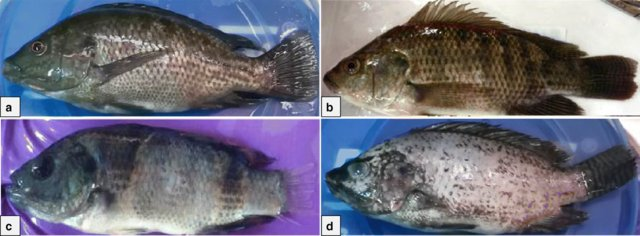
<figcaption>
<strong>Figure 2:</strong> B. Madhusudhana Rao et al (2021) showcasing naturally infected Nile tilapia which show gross signs of (a) cutaneous haemorrhages; (b) irregular scale loss and dark discoloration; (c) severe scale loss and fin rot and (d) peeled skin.
</figcaption>
</figure>

### 2.2 CNNs

Convolutional neural networks (CNNs) have benefited the computer vision community over the past two decades by producing excellent results in object recognition, picture classification and segmentation, natural language processing and other fields. Recent volume increases of available data has only served to strengthen the effects of CNNs in practice.

#### 2.2.1 LeNet-5

Convolutional neural networks draw their formal origin back to LeCun, Bottou, Bengio and Haner (1998). The core of their paper was the LeNet-5 convolutional neural network. This work was built on that of Kunihiko Fukushima who designed the neocognitron. LeNet-5’s main use was in the identification of handwritten digits where it far outperformed alternative methods. The necessity arose from the need to be able to extract meaningful low-dimensional features from sample images. It achieves this through stacking of layers composed of nodes. An image is fed to the network where a filter scans the image and performs convolutions using the input data and a filter to produce a feature map. The final network is assigned random weights and trained on sample data that has labels alongside back propagation to train it in understanding features that make an image belong to a given class.

#### 2.2.2 Feature extraction

Convolutional neural networks went through a fourteen-year period with little to no innovation after their initial formal categorisation in LeNET-5. Instead, other methodologies saw a rise in popularity including kernel methods, ensemble methods and structured estimation. This period was characterised by a focus on feature extraction development. Four of the most prominent contributions in this time include Sivic and Zisserman (2003) text retrieval approach to object matching, Lowe’s (2004) scale invariant feature transform (SIFT), Dala and Triggs’ (2005) histograms of orientated gradients and speeded up robust features (SURF) Bay et al (2006). Each claiming improvements either in calculation speed or robustness. However, all papers still focused on the extraction of image features explicitly rather than implicitly allowing a network to learn the features of importance as seen in modern CNNs.

The idea of learned features itself was not new. Olshausen and Field (1996) provided perhaps the closest approximation to a usable model through their use of sparse coding techniques in automated feature extraction. Other papers that came before had also made advancements and aimed at recreating the visual cortex’s workings. These papers included: Rumelhart and Zipser (1986)’s competitive learning for feature discovery, Sanger (1989)’s single-layer linear feedforward neural network, Hancock et al (1991)’s neural net used to analyse text and Fyfe & Baddeley’s (1995) non-linear data structure extraction through Hebbian network use. Olshausen and Field concluded that all unsupervised learning methods proposed in their paper and that had come before, struggled with the highly nonlinearity property of later stages of the visual pathway.

#### 2.2.3 CNN Development

2012 marked a watershed moment for CNNs with AlexNet being crowned the winner of the ImageNet Large Scale Visual Recognition Challenge. AlexNet showed for the first time that learned features could outperform feature extraction models and by considerable margins. The ImageNet dataset consists of 1000 object categories collected through web scraping and human labelling. More than 1.2 million images are provided for training, with 50,000 labelled images randomly selected for validation and 100,000 unlabelled images used to test models. The percentage of times that a target label for an image does not appear in the top 5 highest probability predictions by a model is used as an evaluation criterion and titled the top-5 error. AlexNet won the 2012 ImageNet competition with a top-5 error of 15.8%, which was 10.8% lower than the runner up. AlexNet’s architecture shares a lot of similarities with LeNet 5 from 1995. Much of the improvements can be attributed to training on larger datasets and use of faster GPUs.

<figure>
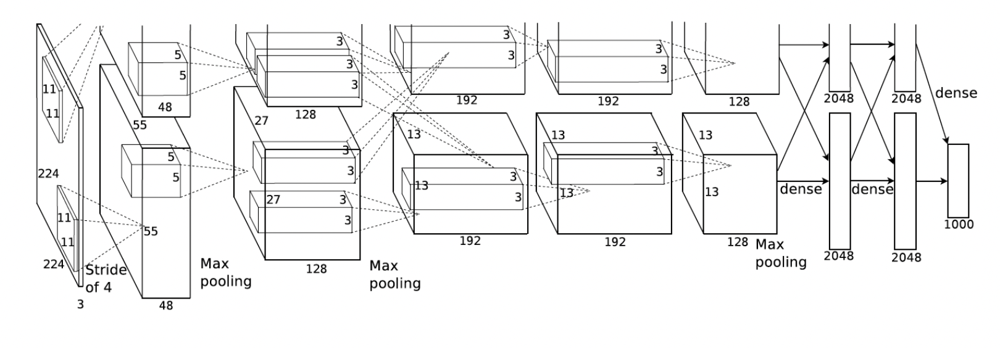
<figcaption>
<strong>Figure 3:</strong> Alexnet architecture from the original paper ImageNet Classification with Deep Convolutional Neural Networks
</figcaption>
</figure>

The Alexnet architecture above showcases the delineation of responsibilities between two GPUs that work in parallel, a consideration necessary for the original implementation to allow computation by two relatively small GPUs to be as efficient as possible. More importantly, the image highlights a few of the key considerations in the architecture, much of which remains relevant to modern CNN implementations. These characteristics include: the kernel size, dropout layer, MaxPool layer, fully connected layer and convolutional layers.

The kernel size for Alexnet in the first layer is 11x11. The kernel is responsible for creating a feature map from pixels. Together with the stride (set to 4) the dimensionality of the image is reduced, and features are extracted from the image through matrix multiplications. The relatively large kernel size compared to that of LeNet5 is in part due to the much larger sized images used in training. 224x224 compared to LeNet5’s 32x32.

Dropout is based on the paper from Hinton et al (2012) titled “Improving neural networks by preventing co-adaptation of feature detectors”. AlexNet implemented a dropout rate of 0.5. The technique consists of setting the output of a neuron to zero with a probability equal to the dropout rate (0.5). These neurons do not contribute to forward passes or backpropagation and force the neural network to sample a different architecture. The technique reduces the reliance on a presence on any singular neuron and creates more robust models.

Max pooling is a popular technique used in down-sampling. Feature maps suffer from the problem that identifying features is location sensitive. Meaning the ability to identify characteristics of an image are partly dependent on where in the image those characteristics are located. Max pooling reduces the spatial dimensions of feature maps and reduces computational cost, controls for overfitting and extracts the most important features. To perform max pooling, you slide a pooling window over a feature map taking the maximum value within each window. Capturing the maximum value allows the retention of the most important characteristics of the image.

Figure 4 showcases the comparison of Alexnet with LeNet5 highlighting the relatively small change in architecture.

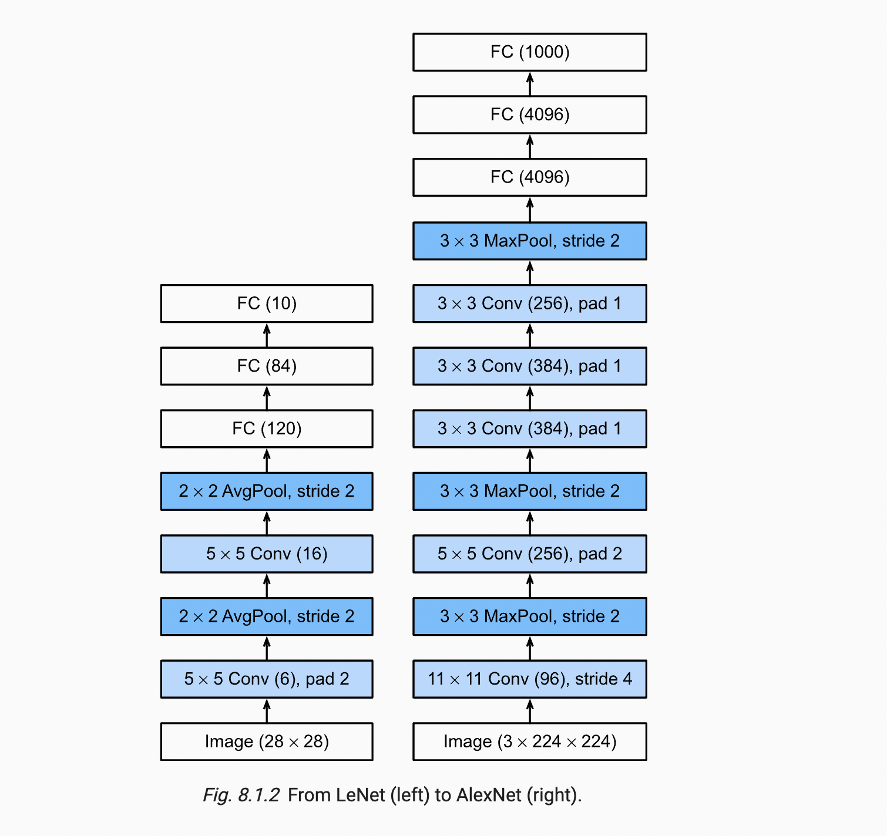

**Figure 4:** AlexNet vs LeNet comparison www.d2l.ai/chapter_convolutional-modern/alexnet.html

From it I can see that, apart from the introduction of a dropout rate the architectural building blocks of the convolutional layers, down-sampling, and fully connected layers have remained similar.

The Visual Geometry Group (VGG) model from Simonyan and Zisserman (2014) is a continuation in the development of the CNN architecture. Again, utilising much of the same building blocks as AlexNet in the form of max pooling layers and fully connected layers. Key architectural choices however gave VGG the ability to ‘learn’ a large number of features both high and low level. These include convolutional filters as small as 3x3 and many filters with later layers having as many as 512 in a single layer. VGGNet16 consists of sixteen layer and has around 138 million parameters. VGGNet16 has been trained for several weeks on datasets of more than 14 million images belonging to 1000 classes spanning a large array of possible subjects. It has been trained for weeks on Nvidia Titan Black GPUs and the weights of the final model released. VGG16 achieves around 92.7% accuracy in the top-5 test in ImageNet making it an ideal candidate for transfer learning.

Transfer learning is a technique in deep learning where a pre-trained model is used as a starting point to solve a different but related problem. This methodology allows for a significant reduction in the amount of data and computation required to train a new model, as the pre-trained model has already learned many useful features from a large dataset.

One common use of transfer learning is in the context of convolutional neural networks (CNNs), where a pre-trained model is used as a feature extractor or fine-tuned for a new task. For example, a pre-trained CNN such as VGG16 can be used as a feature extractor, where the final fully connected layers of the VGG16 model are removed, and a new classifier is added on top of the feature maps generated by the convolutional layers. The new classifier can be trained on a small dataset, and the weights of the convolutional layers are fixed, so they do not change during training.

Another way to use transfer learning with a pre-trained model such as VGG16 is to fine-tune the model for a new task. In this case, the pre-trained model is used as a starting point, and the weights of all or some of the layers are unfrozen and updated during training on the new task. This allows the model to adapt to the new task, while still using the pre-trained features as a starting point.

VGG16 is one example of a trained CNN used for transfer learning. More recently residual Networks (ResNets) published by He et al (2015) have risen in popularity. ResNets are an architecture built on the premise of residual learning. In neural networks before ResNet, a higher depth increased the training error due to the vanishing gradient problem as well as suffering from the accuracy saturation problem in which the performance of a CNN degrades as it gets deeper. ResNet architecture won the 2015 ILSVRC classification task achieving 3.57% error on the ImageNet test set. Residual Nets eight times deeper than VGG have lower complexity due to the inclusion of skips. One or more layers are skipped, allowing the network to more easily learn the residual at each layer. This allows the passing of information from the input layer to deeper layers of the network.

#### 2.2.5 Fish Classification

Deep learning’s application in the field of fish identification and classification, with the goal of automating the process of fish identification dates to 1995. These early studies focused on identifying fish in controlled environments. Strachan and Kell (1995) used shape and colour dependent features to classify dead fish. Storbeck and Daan (2001) used a laser light source to create 3D fish models allowing for the accounting of height, width and thickness of specific species. These systems produced good results in controlled environments and saw implementations in systems such as fishing vessel conveyor belts. Harvey and Shortis (1995) developed an effective approach for real-time underwater fish identification by making fish swim through predefined chambers that were lit to be able to capture their images.

It was only in 2016 with Hongwei et al and Salman et al that fish identification was performed in uncontrolled environments. Hongwei focused on deep CNNs for fish recognition and Salman used deep learning in unconstrained underwater environments for fish species classification.

In Hongwei et al, the authors used a deep convolutional neural network to classify fish with features learned from the dataset meaning no domain knowledge is required. The dataset is collected for the paper with the use of underwater cameras in the open sea. With the collected dataset not being very large, the threat of overfitting to the data is very possible. To combat this the authors doubled the dataset size through image augmentation. This is done using four different methodologies which were rotation: where images are rotated by random angles. Scaling, where the images are scaled to different sizes according to scale factors. Cropping, where patches of the input images are cropped and mirror symmetry in which the original images are horizontally or vertically flipped.

Salman et al’s fish species classification paper aimed to tackle some of the largest problems in deep learning implementation for fish classification. These include the fact that unconstrained underwater scenes are highly variable due to light intensity changes, changes in fish orientation due to movement, changing background habitats and similarity in shape and patterns among fish of different species. Their research was able to correctly classify 90% of fish in the LifeCLEF14 and LifeCLEF15 fish datasets which constitute 73 ocean videos with varying light intensity, fish species and content.

Jin & Liang (2017) propose an underwater fish species recognition framework that utilises an improved median filter. A median filter uses a sliding window to get local pixels’ grey value and replaces the specified pixel with the median value of the sliding window. The improved median filter, which only filters noise pixels, is used to reduce the impact of pulse and Gaussian noise in underwater images. This is combined with an ImageNet pretrained CNN and fine-tuned with the small sample of fish images to produce an 85% accuracy over their dataset taken from Fish4Knowledge. This dataset comprises 23 species of fish with 18 of the species datasets being smaller than 500 images.

A focus on refining data quality through augmentation is also the key to the results achieved by Rathi et al (2017) in their 96% correct classification using the same training data as Jin & Liang (2017). In this paper the authors implement Otsu’s thresholding to create a grey level histogram created from the grayscale image. This is combined with erosion and dilation before the resulting de-noised image is fed to the CNN.

2018 saw the release of the paper “Improving transfer learning and squeeze-and-excitation networks for small-scale fine-grained fish image classification” (Qiu et al). Fish classification is a fine-grained problem which often lacks large enough labelled training datasets. Improving from previous research the focus was even heavier on data augmentation. Qiu et al present a new method for improved transfer learning coupled with super-resolution reconstruction, pre-pretrains, and pretrains to provide an enlarged high-quality dataset. In addition, the use of squeeze-and-excitation blocks are designed to improve bilinear CNNs for fine-grained classification. On both the Croatian and QUT fish datasets the designed CNN models outperform popular CNNs for fish classification accuracy.

Deep & Dash (2019) propose three hybrid models also trained and tested on the Fish4Knowledge dataset. These models include DeepCNN, DeepCNN-SVM and DeepCNN-KNN. DeepCNN-KNN in particular reaches an accuracy of 98.79% on the data. These hybrid models use the CNN architecture for feature extraction before using them in SVM and k-NN classifiers.

Kaur et al (2023) analyse the opportunities, challenges and applications of deep learning frameworks in precision fish farming concluding that the use of deep learning in the field of fish illness diagnostics is set to see a lot of focus going forward.

#### 2.2.6 Nile tilapia classification

Machine learning’s applications to the classification of the Nile tilapia has its early roots in Fouad et al (2013) where support vector machines (SVM) are used in conjunction with Scale Invariant Feature Transform (SIFT) and Speed Up Robust Features (SURF) algorithms for feature extraction. The authors produce experimental results showcasing an outperformance for their classification algorithms compared to k-nearest neighbour and artificial neural networks.

Hernandez (2019) provided an early implementation of deep learning in the form of a CNN architecture to identify Nile tilapia that were harvested whilst suffering from streptococcus agalactiae also called ‘hibay’. Their research showcased promising results with the use of an inception model, Adam optimiser and several test-sets providing 100% accuracy after using 200 training batches. This accuracy was achieved on harvested fish and the results of their research were to produce a model that could identify if a Nile tilapia was harvested in a hibay state. This implementation does little to deal with the intricacies of underwater classification such as light intensity changes and fish orientation.

Fernandes et al (2019) produce a deep learning implementation for the segmentation and extraction of body measurements of Nile tilapia and subsequently use this to estimate the body weight. Their results show intersection over union (IoU) on the test dataset of 99, 90 and 64% for the background, fish body and fin on the Nile tilapia and produce a methodology for non-invasive measurements on live fish in their natural habitat.

Tengtrairat et al (2022) further this work with their paper of non-intrusive fish weight estimation with a focus on Nile tilapia in turbid water. They split the task into a tilapia detection step and the weight estimation step. The detection step utilises the transfer learning to load the weights of a previously trained CNN before fine tuning the weights with the turbid tilapia dataset. The focus of the paper to produce results usable in real-life farming applications is evident not only in their collection of a turbid water dataset for training but also in the computationally simple final model and use of a single channel low-cost video camera for fish observation.

## 3. Dataset

Datasets for Nile Tilapia are sparse. Those that do exist were collected to answer specific research questions and are not easily applied to others. This includes the 4476 images in the hibay dataset from Rayan et al (2021). In the case of this thesis, the focus is on building a CNN that can distinguish from a school of live Nile Tilapia whether a diseased variant suffering from TiLV or Streptococcosis is present. For this both data of healthy and diseased specimens are needed in the same environment. To compound the challenge of data; none of the existing datasets focus on either TiLV or Streptococcosis and very little data is available of Nile tilapia in an underwater environment.

### 3.1 Diseased fish models

The first major hurdle in data collection is that no farms within the European union producing Tilapia have either of the studied diseases present. Any operational farm takes strict measures to minimise risk of disease including farm-specific clothing that is washed every day, use of antibacterial soap, disinfectant hand lotion and disinfectant pools to step into with your shoes when entering any room that houses fish. Furthermore, interviews with tilapia farms also raised the concern that any farm which does suffer from a disease outbreak would never readily admit to this for fear of reputational damage. Making it near impossible to train a CNN in a commercial farm using real diseased fish. However, in order to best train a CNN on identifying disease it is necessary to collect data of diseased fish in the same environment as healthy fish. If diseased fish were readily available, it would not be an easy measure to train a CNN for a specific tank without risking infecting those fish already present and causing both economic and reputational harm to the company.

As both diseases have previously been extensively studied, it is known what the physical characteristics are that indicate the presence of either disease. This can be used in combination with technological developments such as 3D modelling and 3D printing to create hyper realistic fish. These fish have the benefit of not being able to cause harm to existing operations whilst allowing for the training of fine-grained tank specific or even fish batch specific CNNs. This approach is used in this thesis.

#### 3.1.1 3D modelling

The diseased tilapia model’s quality is integral to the performance of the algorithm. Having no prior experience in 3D modelling myself, I hired an artist to complete this work. This artist modelled the tilapia in all its stages of life; from baby to full grown adult. To do this he started start with building a reference board and research document on the subject. Nile tilapias have several characteristics that can be different between individual fish, as well as a number that are the same. After being confident he has a good idea of the characteristics that are important, and those that make it identifiably a Nile tilapia he starts with a 3D modelling program such as Autodesk Maya.

Initially he created a basic blockout model of the fish. This is the first stage of 3D modelling in which a rough and simplified representation of the model’s basic shapes and proportions are made. This helps establish the overall size, shape and composition of the fish and is created using geometric shapes such as cubes, spheres and cylinders. This process makes it easy to adjust the silhouette of the model which is when the model is viewed from a distance or particular angle. It allows for the exploration of different design options and iterating on the overall shape of the model. If this is not completed at an early stage, it can become difficult to fix mistakes at later stages of the modelling process.

With the blockout completed he moves onto the addition of texture. In 3D modelling, UVs are short for texture coordinates. These are used to map a 2D texture onto a 3D model. In this step Victor ‘unfolds’ the previously created 3D blockout onto a flat 2D plane to make it easy to apply a texture or pattern to them in a program such as ZBrush. ZBrush allows us to use their proprietary ‘pixol’ variable that stores the lighting, colour, material, orientation and depth information for each of the points that make up an object.

Continuing in ZBrush he can subdivide the mesh of a 3D model to increase the polygon count, which increases the level of detail that can be added to the model. Through mesh subdivision he can begin to create smaller shapes and add details such as the mouth, fins, eyes and disease characteristics. For this model he opted to add a small marking by the gill of the fish that was often present in either TiLV or Streptococcosis.

He then subdivides the mesh more to add the final details. In this step the scales are added using Noisemaker with a tileable alpha. Noisemaker is a tool in ZBrush, which allows the artist to apply a tileable texture or pattern to the surface of the model. Using a texture or pattern achieves a more uniform and consistent look across the surface of the model.

After the model is sculpted and details have been added, he optimises the mesh for 3D printing through decimation. Decimation is a process which reduces the number of polygons in the mesh whilst preserving important details. In ZBrush he can use the Decimation Master plugin to perform this action. A final step for 3D printing is considering the size limitations. The largest adult Nile tilapia that that I print is approximately 42 centimetres in length. This size is too large for a single print. To solve this issue, Victor slices the fish model into two pieces using the ZBrush tool SliceCurve. Once sliced, any new holes or gaps in the mesh can be automatically filled with the Fill Hole option, creating a watertight mesh.

With feedback from a Nile tilapia farm, he tweaks the created designs to best represent the fish and create 12 distinct models for different sizes ranging from a baby Nile tilapia of a few grams to a full-grown adult of 800+ grams. In the adult model he also creates two versions with one having the dorsal fin extended and the other retracted to best capture the natural states of the fish.

Figures 5 and 6 below showcase the finished models for both the extruding and non-extruding dorsal fin of an adult Nile tilapia. In Figure 6 you can also see the extra support pillars generated so that all elements of the fish are supported during printing.

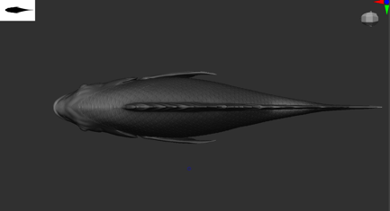

<figure>
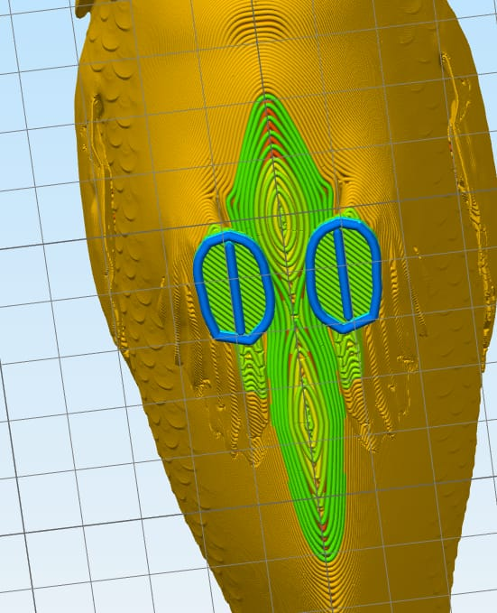
<figcaption>
<strong>Figure 5</strong>: Adult Nile Tilapia model with extruding dorsal fin in Blender
</figcaption>
</figure>

**Figure 6:** Adult Nile Tilapia without extruding dorsal fin model in Simplify3D

#### 3.1.2 3D printing

The finished models were exported in the ‘.fbx’ extension. This file format is used for 3D models and animations in film and gaming industries. However, this extension is not appropriate for 3D printing. Blender and Simplify3D are used to transform the file format into ‘.stl’ and ‘.gcode’ respectively. G-code files contain instructions for machines to control their movement and allow the 3D model to be printed by a 3D printer.

The model sizes ranged from 1cm to 42cm. Due to size and time constraints the prints had to be divided across two 3D printers. The first, the Prusa i3 MK2.5S, is a desktop printer with a build volume of 250 x 210 x 200 mm and uses an open filament system. This printer has a layer resolution of 50 microns and uses the Fused Deposition Modeling (FDM) printing technique of melting plastic filament and depositing these layer by layer. This printer was used to print 1, 1.5, 2x2, 2x2.5, 2x8, 2x12 and 22cm models and used white PLA filament 1.75mm material in its prints. For the 2.5cm fish prints took approximately 15 minutes, with prints of 10cm taking 2 hours and the 22cm size 6 hours. The process of printing can be seen in Figure 7 which showcases the print at roughly 20% and 75% of completion.

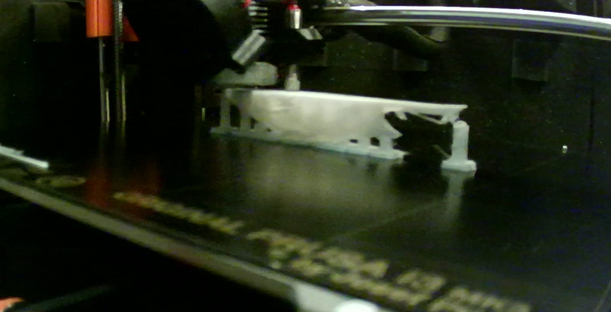

**Figure 7:** 8cm model print on the Prusa i3 at 20% and 75% completion

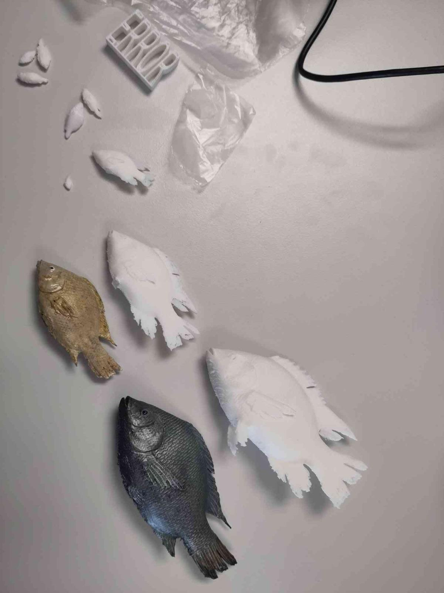The larger models were printed with the Creality CR6-MAX. This printer has a build volume of 400 x 400 x 400 mm. This is significantly larger than the Prusa i3. The layer resolution is 100 microns and is also based on using FDM as the print technique. This printer was used to print 28cm and 42cm models using grey e-Sun PLA+ filament 1.75mm material. The largest model of 42cm took around 24 hours with the 28cm size taking 16 hours. Figure 8 shows a larger print in process.

**Figure 8:** Half of the 28cm model printing on the Creality printer as well as an image of the printing timer

**Figure 9:** Several defect prints in models ranging from 1cm to 12cm

3D printing is a sensitive process that can encounter mistakes during printing with relative ease. The larger models required up to three iterations to print successfully. Figure 9 showcases a small subset of the defect smaller tilapia model print failures. Improvements are made between prints by tweaking the support system, material feeding and printing bed calibration.

#### 3.1.3 Painting

With completion of the model print the natural next step is to paint the models. To ensure the paint can stick to the models they must first be primed. Priming is a process in which a preparatory layer of paint is used to coat the surface of a model. My goal is to create a smooth surface that will help the subsequent layers of paint stick. After application of the primer, each model is allowed to dry for 12 hours before layers of model paint are applied.

The performance of my algorithm is strongly correlated to my ability to mimic as close as possible the look of a diseased Nile tilapia. During this step I worked closely with Gårdsfisk, a Nile tilapia farm in Sweden. All models went through multiple iterations of paint, gathering feedback from the farm after each round. Alongside this I used a combination of healthy tilapia images taken at Gårdsfisk as well as images of diseased fish found in academic journals to inspire the look of my models.

**Figure 10:** Fish model painting station setup

<figure>
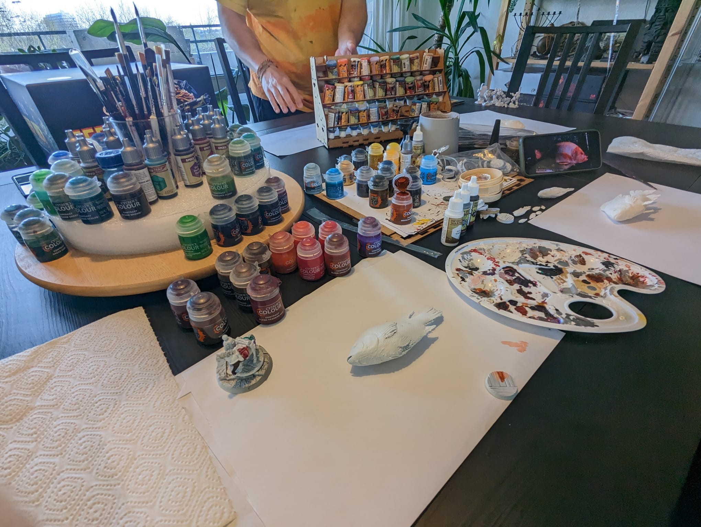
<figcaption>
<strong>Figure 11:</strong> 8 cm 3D printed red strain Nile tilapia painted
</figcaption>
</figure>

After applying the layers of paint, I used a dry-brushing technique to help the colours blend seamlessly into each other. Use of this methodology produced results that garnered strong positive feedback from Gårdsfisk on its authentic looking patterns on the fish.

The inclusion of disease in figure 11 showcasing the 8cm red strain tilapia can be seen from the darker red markings near the base of the tail and gills, discolouration in the eyes as well as yellow and white discolouration along the body.

Finally figure 12 showcases the process of applying multiple layers of glossy varnish to each model to seal in the paint and ensure that when submerged there are no risks to the colours running off. The gloss also aligns with the natural look of Nile tilapia under water.

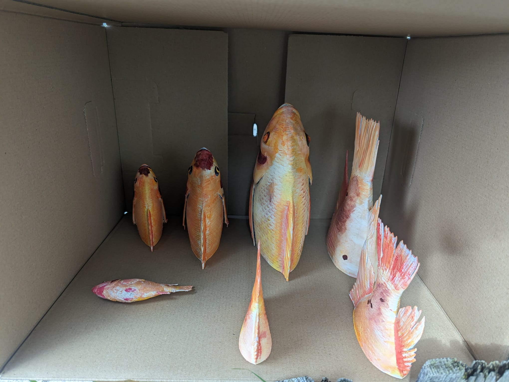

***.­­***

**Figure 12:** Various adult Nile tilapia models enclosed in a box to contain the gloss varnish sprayed on.

### 3.2 Data collection

Nile tilapia farms are very limited in numbers within Europe. Amongst the reasons for this are relatively low market price of Nile tilapia, higher regulation, low demand and higher land and labour costs when compared to countries with high Nile tilapia consumption. However, stricter regulations within the European Union brings an upside to Tilapia production. Gårdsfisk, one of the few Nile tilapia farms in Europe, runs a genetic breeding program for their fish-fry. Choosing new broodstock based on favourable characteristics. Demand from outside Europe for these fry stems from the health and quality of the fish produced in comparison to countries with lower fish fry prices and lower regulation.

#### 3.2.1 Gårdsfisk

Gårdsfisk is a Swedish fish farm that produces sustainable fish through integrated farming and aquaculture. The founders, Johan Ljungquist and Mikael Olenmark Dessalles, aimed to create a sustainable and environmentally friendly alternative to industrial fishing and conventional fish farming. They use a method called integrated agriculture and aquaculture, which involves using the manure produced by animal husbandry to fertilise the fields and feed the plants, while the plants filter the water that is used to raise the fish. This system allows for a nutritional balance between crops and protein and ensures a low environmental impact.

Gårdsfisk's vision is to contribute to sustained and sustainable food consumption by producing more of the world's most sustainable fish. The farm has achieved its goal of creating a fish breeding system without emissions and negative environmental impact and a new industry in the countryside. Gårdsfisk delivers fish to the entire country, reducing the need for imported fish.

#### 3.2.2 Collection

From Monday 24th of April 2023 until Friday 28th of April 2023 I spent from 7am until 4pm at the Gårdsfisk fish farm in their Tollarp facility. Of importance in the beginning was learning how to navigate the various rooms safely, ensuring I do not cross contaminate the fish tanks. Particular attention was paid to manoeuvring safely within a busy fish farm operation without disturbing the ongoing work.

The first full days of data collection were Tuesday and Wednesday which I spent collecting base images of the various fish tanks and testing the underwater equipment. Figure 13 below shows one of these images as well as the above water view of the tank in question. For image collection an iPhone 13, 128gb model was used. This was inserted into a JOTO waterproof case to protect it from any water damage. For image collection the app Skyflow was used. This choice was made due to the app's ability to customise the timelapse feature. Superior over the native iPhone camera app, Skyflow allows for timelapse constraints to be set either in total elapsed time or total number of pictures as well as having options for setting the timing between images, exposure, white balance and horizon level.

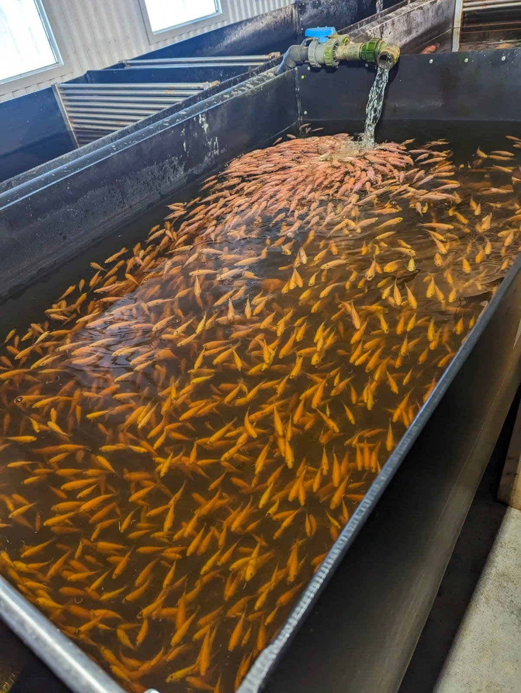

**Figure 13:** An image of the red strain Nile tilapia tank at Gårdsfisk containing fish of approximately 4cm alongside an image collected from within the same tank

When training an algorithm to detect the presence of disease in Nile tilapia it is of key importance to keep as much as possible the same between the data collection windows of the healthy fish dataset, and the presence of diseased fish dataset. This includes keeping the same time of day of collection, depth of camera, fish tank. This is done to avoid the algorithm associating non-valid details with diseased or healthy fish. If all the healthy pictures are taken in the morning, and the diseased pictures at night the algorithm will end up learning that time of data collection (or light intensity) is a key factor when this is not the case. One of the main challenges in the dataset collection was the buoyancy of the printed models. This is further elaborated below but resulted in restarting the collection of data on Thursday the 27th of April. The full length of Thursday and Friday were spent collecting images of both the diseased and healthy datasets.

With time being a limited resource, I chose to focus on the collection of data for Nile tilapia in the range of 2-4 cm collecting upwards of 10,000 images and using two separate painted models.

#### 3.2.3 Challenges in dataset collection

Across the 5 days of data collection there were several challenges that had to be overcome, and at times resulted in restarting the data collection efforts.

Initial data collection focused on taking pictures of Nile tilapia tanks housing fish ranging in size from 2cm to 40cm. These images were collected to populate the healthy Nile tilapia dataset. This collection as well as becoming familiar with operating safely in the farm took a considerable part of the first two full days.

The major setback came after starting the collection of the images of Nile tilapia containing a single diseased fish model. Due to the print methodology and material, the fish were printed watertight but with significant air pockets inside. This made the models incredibly buoyant. This was notable in the smaller models and became a larger issue the bigger the model became. The delicacy of the models as well as a lack of tools drilling a hole for the air escape was not a suitable choice. Various methods were attempted including weighing the models down by string and using metal wire to hold it under. However, none of these methods proved successful. In the end I purchased a see-through plastic rod and taped the fish models against this. Figure 14 below shows the presence of this clear plastic rod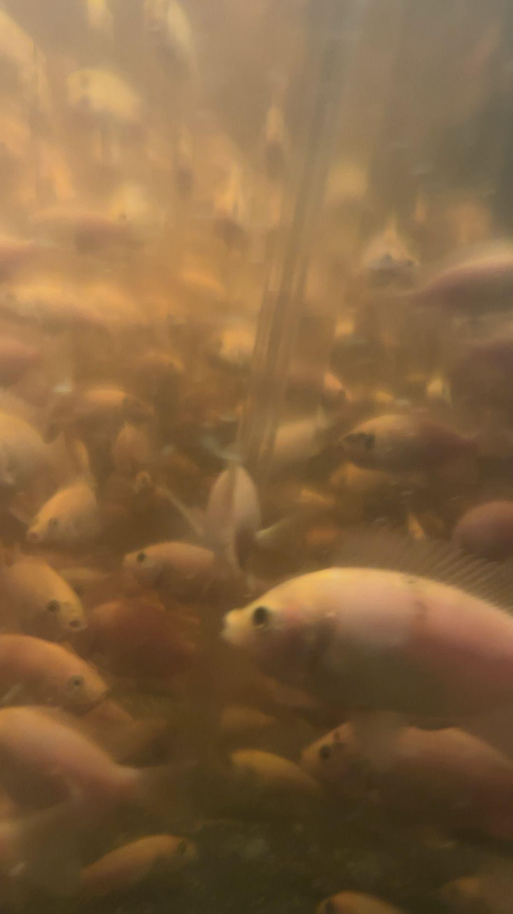 that is still visible in the image.

**Figure 14:** Collected image of red strain Nile tilapia showcasing the clear plastic rod used to manoeuvre fish models

With the earlier discussed importance of homogeneity of data collection practices, the presence of a visible clear plastic rod in the images meant that the previously collected base images were no longer of use. If diseased fish images were to be collected by taping the model to a clear plastic rod that is visible in pictures, the same rod (without fish) would have to be present and moving in the dataset of images of only healthy fish. This avoids the accidental training of spotting the clear plastic rod as an indicator of disease.

Due to this setback the decision was made to focus the data collection efforts on a single tank using both the 4cm sick fish models. This allowed for the collection of a significant body of data useful and required for the training of CNNs. Having models in sizes ranging from 1-42cm offered me the flexibility of testing this technique extensively and collecting data that will improve the future iterations of this project. Changes to the 3D models have been made to allow an escape of air in a multitude of places in future prints which will help significantly with countering the material’s natural buoyancy.

#### 3.2.4 Healthy and sick 

The classification of an image being of a diseased fish is when there is a single diseased fish present in the image. This decision was made with the support of Gårdsfisk. Though disease within a fish habitat can cause a multitude of fish to be affected at the same time, it often starts with very low numbers of fish impacted and that an early detection system should be trained on spotting symptoms when a single fish in the picture is diseased.

Figure 15 shows three images taken from the healthy fish dataset. In these pictures the plastic rod, which was used to counteract the buoyancy in the sick fish data collection, is also present. Figure 16 shows three images taken from the sick fish dataset. In each picture a Nile tilapia model is visible along with the clear plastic rod. These images showcase the visible difference in images that belong to each dataset.

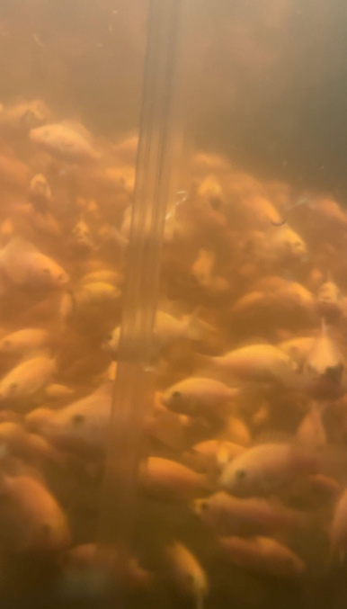

<figure>
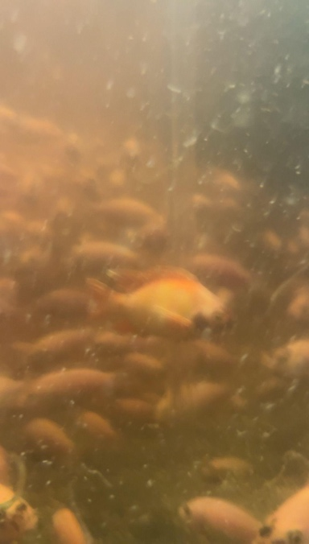
<figcaption>
<strong>Figure 15:</strong> Three images from the Healthy fish dataset
</figcaption>
</figure>

**Figure 16:** Three images from the Sick fish dataset

### 3.3 Data exploration

Having collected over 20,000 images for the Nile tilapia tank housing fish of approximately 8cm in size the data must first be inspected and cleaned manually. In the sick fish dataset this involves removing any pictures that do not include the models of the sick fish within camera view. Then for both the healthy and sick fish dataset this further involves removing images not that are not relevant including time lapse pictures taken before the camera was lowered into the tank.

After this initial clean-up the total data size is 2.73gb with the sick fish dataset comprising 1.92gb of the total. This amounts to 7566 images in the sick fish dataset and 3163 in the healthy fish dataset.

#### 3.3.1 Initial dataset understanding

Table 1 below shows the specifics of the two collected datasets. Between the healthy and sick fish dataset there is a mismatch in the number of images amounting to 4403 more images containing sick fish than strictly healthy. Furthermore, both datasets contain images in the range of 1920x1080 and 2560x1440 pixels rather than a single uniform size.

| Dataset  | N. of images | Image sizes               |
|--------------|------------------|-------------------------------|
| Healthy_Fish | 3163             | (1920, 1080) and (2560, 1440) |
| Sick_Fish    | 7566             | (1920, 1080) and (2560, 1440) |

**Table 1:** Statistics on collected dataset.

Having images of different sizes within the same dataset can cause issues in my CNN training. During the convolutional operations the chosen filter size may extract different features for the same image if those images are of different sizes. With the gradient updates during backpropagation, it can also have the effect of causing inconsistent weight updates that cause slower convergence or suboptimal performance in the final CNN.

Having datasets that are imbalanced can also cause a number of issues in my final CNN including a class imbalance. Here the CNN may be more inclined to predict samples from the sick class accurately whilst struggling with accurately classifying images as belonging to the healthy class. This bias can result in a higher false positive rate. There may also be some bias in the form of the CNN not having been exposed to enough examples of healthy fish data which would limit the ability for the model to generalise patterns between the classes.

Both the image sizes present in the dataset have an aspect ratio of 1.78. The benefit of this is that the higher resolution images can be scaled down without impacting their usability. However, the presence of an aspect ratio larger than 1 introduces more complexity later in my CNN that should be considered. One such consideration is the use of fully connected layers. Fully connected layers expect input of fixed size. Changing the spatial size of the input image impacts the CNN inference ability.

The issues concerning the number of images and the difference in sizes can be fixed through data augmentation techniques. The first of these is related to increasing the number of images in the Healthy_Fish dataset to equal that of the Sick_Fish. These can include image flipping, rotation, scaling, cropping, noise addition, colour jittering and cutout or masking to name a select few. The techniques employed must abide by the logic of the image. The datasets focus on schools of fish and techniques such as vertically flipping images would not help train a more robust CNN.

Mujtaba et al (2021) apply various data augmentation techniques in their paper titled ‘Fish Species Classification with Data Augmentation’ including randomly increasing or decreasing the brightness of an image, generating Gaussian noise to be added to images and applying blur distortion at randomly selected thresholds. These provide the basis for the data augmentation performed in this paper.

#### 3.3.2 Data augmentation

It is of importance that the gap is closed between the Healthy_Fish and Sick_Fish datasets to produce a CNN that will not be biased towards predicting the presence of illness in the tilapia. Before I augment the data to increase the number of images, I transform all the images to be of the size 1120x630 pixels as well as splitting the datasets into training, validation and testing. Augmented data should not be used in the testing and validation of my CNN. The number of images in each split can be seen from table 2.

| Dataset        | N. of images | Image sizes |
|--------------------|------------------|-----------------|
| test_Healthy       | 476              | (1120, 630)     |
| validation_Healthy | 790              | (1120, 630)     |
| train_Healthy      | 1897             | (1120, 630)     |
| test_Sick          | 476              | (1120, 630)     |
| validation_Sick    | 1038             | (1120, 630)     |
| train_Sick         | 6052             | (1120, 630)     |

**Table 2:** Datasets image numbers after splitting into train, validation and test sets

##### 3.3.2.1 Brightness adjustment

With my data split, I can now apply data augmentation techniques to my training data for both healthy and sick fish. Currently there is a disparity between the healthy and sick training data which if left would likely lead to a biased classification of sick fish. I start with doubling the train_Healthy dataset by applying a randomly generated brightness modification to each of the starting pictures. Fish tanks are susceptible to changes in light and brightness depending on the surrounding conditions such as use of lighting within the buildings and time of day pictures are taken. Increasing the data available with brightness modification is in principle a useful way for increasing the overall quality of the CNN in detecting the presence of disease.

The first iteration of the code written for this purpose resulted in a large multiple of the images having an original vs brightness adjusted comparison as shown in figure 17. This issue arises when altering the brightness of pixels resorts in the pixel value being an overflow or underflow. This is better understood when seen that the large patches of black are in the fish themselves, which are the brightest objects in the picture. Applying a brightening factor to the hue up to 50% higher than in the original picture has had the effect of overflowing the fish colour values. After clamping the value at a maximum of 0 to 255 this issue was resolved.

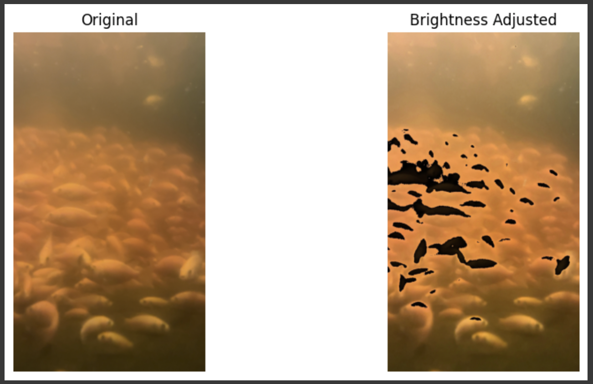

**Figure 17:** An image from the Healthy_Fish dataset next to the same image after brightness modification

After changes to the size and increasing the number of images through brightness modification my training datasets are reflected in table 3.

| Dataset   | N. of images |
|---------------|------------------|
| train_Healthy | 3794             |
| train_Sick    | 6052             |

**Table 3:** Statistics on collected datasets after brightness data augmentation

There is still a significant gap of 2258 images between the datasets of healthy and sick training. To help close this gap I apply several augmentation techniques to create new data points. I split the number of images into three distinct techniques generating 753 images through each of zooming, cutout, and saturation adjustment.

##### 3.3.2.1 Cut-out adjustment

With the use of cutout I randomly mask rectangular regions of the image with a black box of between 100 and 300 pixels in total. Figure 18 below shows an example of the cutout data augmentation. The use of cut-out helps the CNN focus on other parts of the image and learn more robust features. This data augmentation technique can lead to an improved generalisation ability of the CNN. It should also lead to improved performance in the face of noise. The new dataset totals are reflected in table 4. The results from this paper show an improvement in the generalisation ability of the model with the implementation of the cut-out data augmentation technique. With and without its usage the trained model scores 0.9687 and 0.8372 test scores respectively.

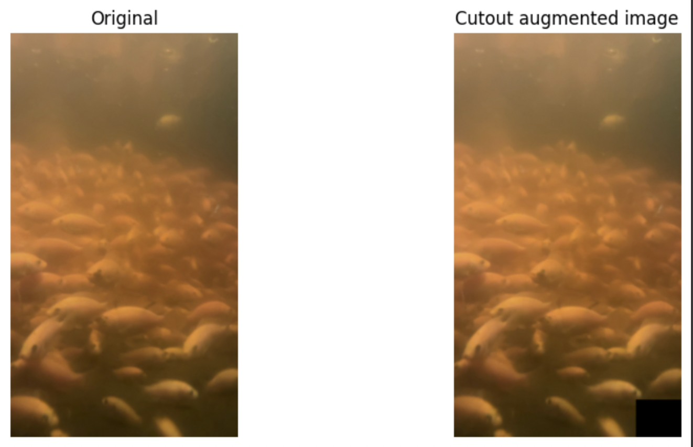

**Figure 18:** Pre and post augmented image using a cut-out visible in the bottom right of the augmented image

| Dataset            | N. of images |
|------------------------|------------------|
| train_Healthy + cutout | 4547             |
| train_Sick             | 6052             |

**Table 4:** Training dataset image total after cut-out augmentation

##### 3.3.2.2 Zoom adjustment

Within the zoom technique I select a random portion of an image and scale it. We’ve chosen a zoom factor between 1.1 and 1.5 (where 1.0 is no zoom) which results in new images that are zoomed in. This choice is made to allow the new picture to fill the 1920 x 1080-pixel space which would not be possible when zooming out. This technique helps the model learn to recognise objects at different scales and handle variation in object size. This should allow the model to be better at generalising and gain a better spatial ‘awareness’. The new dataset totals are reflected in table 5 below.

| Dataset                   | N. of images |
|-------------------------------|------------------|
| train_Healthy + cutout + zoom | 5299             |
| train_Sick                    | 6052             |

**Table 5:** Training dataset image total after zoom augmentation

##### 3.3.2.3 Saturation adjustment

Saturation involves adjusting the intensity of the colours either up or down. An example of this in my data can be seen from figure 19. Adjusting the saturation of images to create new data helps the model become more robust to changes in lighting. This is particularly useful in the environment of fish farms where light intensity inside a unit can be regulated and changed. The new size of both the datasets is reflected in table 6 showing that the latest augmentation has aligned the sizes of the datasets.

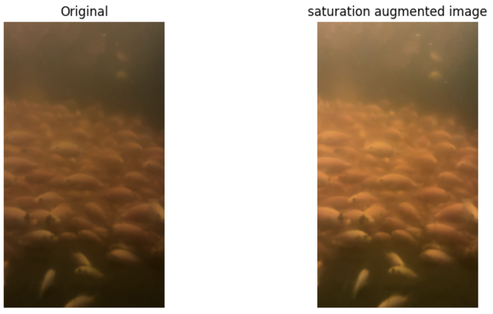

F**igure 19:** Pre and post saturation augmentation of a healthy fish training data

| Dataset                                | N. of images |
|--------------------------------------------|------------------|
| train_Healthy + cutout + zoom + saturation | 6052             |
| train_Sick                                 | 6052             |

**Table 6:** Training dataset image total after saturation augmentation

##### 3.3.2.4 Horizontal image flip

Horizontal axis flip is a technique in which you flip the image horizontally along its central axis, effectively reversing the left and right side. Figure 17 below shows a representation of this in my dataset. Performing this augmentation furthers the robustness of the model and generates around 20% extra data, or 1210 new images in my dataset. Table 7 reflects the final numbers of my datasets. The subject of my images, a school of fish, lends itself nicely to a horizontal flip. Whereas entire schools of fish are never going to be upside down, flipping them horizontally creates a new image of a likely scenario. Figure 20 shows an example of an image pre and post flip.

<figure>
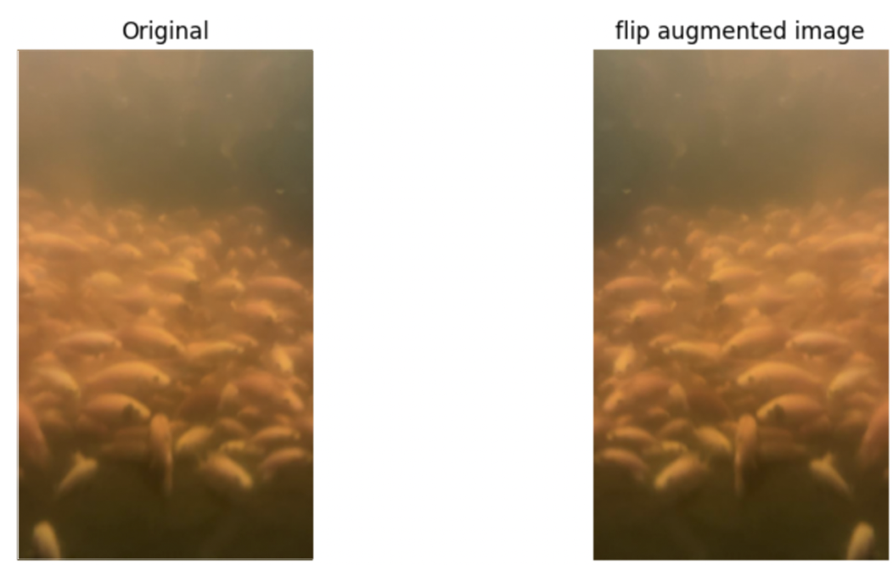
</figure>

**Figure 20:** Pre and post flipped image augmentation

| Dataset | N. of images |
|----|----|
| train_Healthy + cutout + zoom + saturation + vertical axis flip | 7262 |
| train_Sick + vertical axis flip | 7262 |

**Table 7:** Training dataset image total after flipped image augmentation

##### 3.3.2.5 Gaussian noise

The final augmentation I perform is the application of gaussian noise to 5% of my original image sets. This has the effect of applying this effect in a higher number to my train_Sick dataset due to the larger beginning dataset before augmentation. Gaussian noise involves adding random noise to pixel values based on Gaussian distribution. This helps mimic realistic imperfections working to enhance the model’s robustness to noise in input data. The application of noise is done over several of the images in the dataset without creating extra data points. Table 8 reflects the final number of images showing this has not changed with the introduction of noise.

| Dataset | N. of images |
|----|----|
| train_Healthy + cutout + zoom + saturation + vertical axis flip + Gaussian noise | 7262 |
| train_Sick + vertical axis flip + Gaussian noise | 7262 |

**Table 8:** Training dataset image total after Gaussian noise augmentation

## 4. Methodology

For a Nile tilapia farm, it is of utmost importance to be aware, as early as possible, of the presence of diseased fish in their habitat. Little care is given to know which fish is sick as tanks are treated in solidarity. Figure 21 shows an average adult Nile tilapia tank at Gårdsfisk, this tank can house approximately 2000 fish of this size. The number of fish in a tank, alongside the fact there are many tanks in a facility and the view into a tank is only from the top means it is incredibly difficult for a farmer to visually spot any disease in individual fish.

**Figure 21:** An Adult Nile tilapia tank at Gårdsfisk

When designing CNNs for this purpose consideration must be given to factors that influence the architecture including the complexity of the domain and the size and format of the input data.

### 4.1 Fully connected layers

One major consideration in both the self-trained CNN and transfer learning techniques is the use of fully connected layers. Where convolutional layers preserve regional spatial information, this is not necessary in the final classification of an image and the fully connected layer combines features globally. In the fully connected layer, the weighted sum of the deep features is calculated. As a fully connected (or Dense layer) flattens the dimensionality of data into a one-dimensional vector the input scale of the data has a significant impact on the computational requirements. Taking an image of dimensions 32x32 with three colour channels (RGB) results in a fully connected layer input dimension of 32x32x3 = 3072. The image sizes used in training need to be scaled to fit the computational availability.

### 4.2 Self-trained CNN

For the self-trained CNN architecture, I use a combination of convolutional layers, max pooling, dropout and a dense layer. This gradually reduces the spatial dimensionality of the data whilst increasing the number of trainable parameters.

For the loss function binary cross entropy is used. In binary classification tasks this loss function is commonly used. Measuring the dissimilarity between predicted probability distribution and true distribution of the target variable. Testing is performed for Hinge and KL Divergence, but these fall short of the performance obtained by binary classification.

For the optimiser parameter I use adaptive moment estimation (adam). This optimization algorithm is commonly used for deep neural network training. Combining the benefits of AdaGrad and RMSProp algorithms and adapting the learning rate during training based on gradient updates. I briefly test the usage of stochastic gradient descent (SGD) and RMSprop but find worse performance compared to adam.

I use accuracy as an evaluation metric for the model. This is computed during training to monitor the model’s performance. It measures the proportion of correctly predicted instances in the binary classification task.

I use a sequential model that allows for stacking of layers. In total I use six conv2d layers which are followed by batch normalisation and max pooling. The max pooling serves to lower the dimensionality of the feature maps as well as hone the focus on the most important features through translation invariance. Batch normalisation improves performance and stability in results through the recentering and rescaling of a layer’s inputs and was first proposed by Loffe and Szegedy (2015). This results in more stable weight updates between layers as they have consistent means and variances.

The total trainable parameters in this model amount to 4,321,233 with an input image size of 1120x630 pixels. Approximately 4 million of these parameters come from the dense layer that translates the dimensionality into a single dimensional vector.

Further hyperparameter optimisation was achieved through trial and error. These consisted of the optimiser, loss function, kernel size, convolutional layers, trainable parameters, steps per epoch, batch size, learning rate, data augmentation usage and epochs.

Rescaling of the pixel values was implemented in the form ‘1./255’ for both the train_datagen and test_datagen. This parameter scales the pixel values between the values of 0 and 1. Rescaling helps achieve numerical stability during model training.

**Figure 22:** Self-trained model architecture showcasing both a graph of the inputs and outputs at each layer as well as a second diagram giving the output shape per layer alongside the trainable parameters

### 4.3 Transfer learning CNN

For the transfer learning technique the ResNet-18 model is used with pretrained weights. ResNet-18 has been implemented several times before. For this reason my ResNet implementation is not novel and is inspired by Kirudang’s medium post implementing ResNet transfer learning for skin cancer classification. This is implemented through the PyTorch library. My code defines a custom CNN as a subclass of the PyTorch nn.Module class. All but the last two fully connected layers have their weights frozen. This allows us to leverage the pre-trained convolutional layers of ResNet-18 that have already learned a good level of generalisation over a large number of classes through training on ImageNet dataset. I alter the weights of the unfrozen fully connected layers by training the weights on the training dataset data.

I transform the input images into tensors and normalise them using the mean and standard deviation values of mean=\[0.485, 0.456, 0.406\] and std=\[0.229, 0.224, 0.225\]. Normalisation helps ensure that each channel of the image has a similar scale. These values are computed from the ImageNet dataset and used commonly in pre-trained models such as ResNet-18.

The loss function on the ResNet-18 model is effectively the same as in my self-trained CNN. I use cross entropy for the loss function, with only two possible outcomes this is equivalent to binary cross entropy in its implementation. I extend this similarity in architecture choice to the optimiser where I use adam through torch.optim.Adam. The hyperparameters of epochs, batch size and learning rate are tweaked to find the best performing model.

## 5. Results

This section presents the results for the hyperparameter testing for both the self-trained CNN and the ResNet-18 model along with the final choices for hyperparameters for both. The results are interpreted, and suggestions are provided for future improvements and areas of focus

### 5.1 Self-trained CNN

The results of the hyperparameter testing for the self-trained CNN is presented in Table 9 below. The hyperparameters considered consisted of the optimiser, loss function, kernel size, convolutional layers, number of trainable parameters, steps per epoch, batch size, learning rate, data augmentation usage and epochs.

A V100 GPU was used in the training of these CNNs giving access to 16GB of GPU RAM. Though the initial pictures are at a resolution of either 1920 by 1080 pixels or 2540 by 1980 pixels, the largest image size supported by the GPU constraints are 1120 by 630 pixels. The impact of a reduction in pixels is only marginal with the best performing model on the 1120 by 630 pixels scoring 0.9967 on the test images.

| Identifying number | Optimiser | Loss function | Kernel size | Conv-layers | Dense layer neurons | Trainable parameters | Steps per epoch | Batch size | Epochs | Test Score | Model change |
|----|----|----|----|----|----|----|----|----|----|----|----|
| 1 | Adam | Binary cross entropy | 3,3 | 6 | 256 | 3.7m | 226 | 32 | 10 | 0.8685 | Base |
| 2 | Adam | Binary cross entropy | 3,3 | 6 | 256 | 3.7m | 151 | 32 | 10 | 0.9612 | Fewer steps per epoch |
| 3 | Adam | Binary cross entropy | 4,4 | 6 | 128 | 2.0m | 151 | 32 | 10 | 0.9170 | Less trainable parameters and higher kernel size |
| 4 | Adam | Binary cross entropy | 2,2 | 6 | 128 | 2.2m | 226 | 32 | 10 | 0.9547 | Less trainable parameters and lower kernel size |
| 5 | Adam | Binary cross entropy | 2,2 | 6 | 256 | 4.3m | 226 | 32 | 10 | 0.9687 | More trainable parameters and lower kernel size |
| 6 | Adam | Binary cross entropy | 2,2 | 6 | 256 | 4.3m | 113 | 32 | 10 | 0.9504 | Lower steps per epoch |
| 7 | Adam | Binary cross entropy | 3,3 | 6 | 256 | 4.3m | 151 | 32 | 20 | 0.8340 | Lower steps per epoch and more epochs |
| 8 | Adam | Binary cross entropy | 3,3 | 6 | 256 | 4.3m | 151 | 48 | 10 | 0.9342 | Higher batch size |
| 9 | Adam | Binary cross entropy | 2,2 | 6 | 256 | 4.3m | 453 | 32 | 10 | 0.9428 | More steps per epoch |
| 10 | Adam | Binary cross entropy | 2,2 | 6 | 256 | 4.3m | 226 | 32 | 10 | 0.8372 | No cutout data augmentation used |
| 11 | SGD | Hinge | 3,3 | 6 | 256 | 4.3m | 226 | 32 | 10 | 0.9579 | Different loss function and optimizer |
| 12 | RMSprop | KLDivergence | 3,3 | 6 | 256 | 4.3m | 226 | 32 | 10 | 0.9579 | Different loss function and optimizer |
| 13 | Adam | Binary cross entropy | 2,2 | 6 | 256 | 4.3m | 226 | 32 | 10 | 0.9967 | High learning rate of 0.001 used |
| 14 | Adam | Binary cross entropy | 2,2 | 6 | 256 | 4.3m | 226 | 32 | 10 | 0.9956 | Low learning rate of 0.0001 used |

**Table 9:** Test results for models with alterations to hyperparameters for the self-trained CNN

#### 5.1.1 Hyperparameter tuning results

The base model shown by ID number 1 in Table 9 scored 0.8685 during the testing. This model uses 6 convolutional layers, a 3,3 kernel size, a dropout of 0.5 in the final layer as well as other hyperparameter values observable from the table.

The first hyperparameter to be altered was the number of steps per epoch. Reducing the batches used per epoch shows an improvement in the generalisation of the model and can be seen by ID 2 in the table. The test score improves from an initial 0.8685 to 0.9612. Figure 23 below showcases the training and validation accuracy and loss. On the left hand side are the graphs for the base model (ID 1) showcasing the initial architecture decisions I made and on the right the graphs for the reduced batch-number per epoch model (ID 2).

**Figure 23:** Train and validation accuracy and loss graphs for the base model (left) and the smaller batch model (right)

Both the base model and reduced batch model show significant variation in the validation loss between epochs. As both models do not use all the data in each epoch it is possible that a mini-batch contains challenging or noisy data. As the models both use batch normalisation between layers, it is also possible that epochs can shift the normalisation parameters significantly and influence the model’s training behaviour. Looking beyond this variability you can see that the base model could still be showing underfitting and that more epochs could be used to improve generalisation. Although the use of fewer batches per epoch shows improved generalisation as seen from the right hand graphs in figure 23, there is overfitting occurring from the 6th epoch onwards which can be seen by the deteriorating validation loss.

The next two changes to the model focus on the number of trainable parameters and kernel size. Reducing the trainable parameters and increasing kernel size results in a model that generalises better than the base model (table 9 ID 1) but worse than the previously trained mini-batch model (table 9 ID 2). Reducing the trainable parameters by almost half and decreasing the kernel size to 2,2 (table 9 ID 4) decreases the test score compared to model 2 scoring 0.9547. An increase of the kernel size however (table 9 ID 3) reduces the generalisation by a larger amount scoring 0.9170. Given the significant reduction in trainable parameters, model 4 does well to only lose a 1% generalisation ability. This inspires the next hyperparameter testing where the kernel size is kept at 2,2 and the number of trainable parameters is increased to 4.3m. This model (table 9 ID 5) scores 0.9687 on the test set outperforming the previous best model 2.

Figure 24 below showcases the loss and accuracy scores for model 5 from table 9 and shows a trend of good fit over the epochs where the loss and accuracy converge without showing either under or overfitting. The use of mini batches here is also evident in the higher variance of the loss between epochs.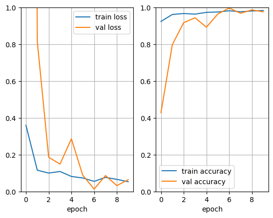

**Figure 24:** Training and validation loss and accuracy for a 2,2 kernel size, 4.3m trainable parameters model across 10 epochs

The next seven models tested (table 9 ID 6 till 12) varied hyperparameters including the steps per epoch, number of epochs, batch size, data augmentation used, loss function and optimizer. Across all new models none outperformed the above model in generalising over the test data. Altering the loss function and optimizer came the closest but still showed worse performance compared to adam and binary cross entropy.

The last set of testing focused on the learning rate used. These are models 13 and 14 in the table. Using the best performing model found in earlier testing and altering the learning rate to both a low and high number yielded strong results over the testing data of 0.9956 and 0.9967 respectively.

Ultimately the best performing model was setting the learning rate high to 0.001. Figure 25 below shows the training and validation loss and accuracy for both the low learning rate (left) and high learning rate (right).

**Figure 25:** Training and validation loss and accuracy graphs for the low learning rate (left) and high learning rate (right) models

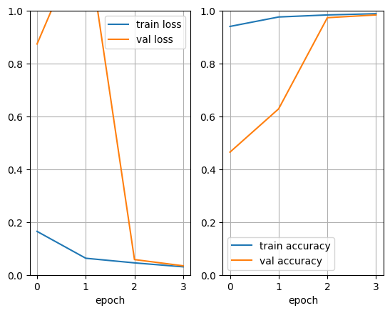In figure 25 you can notice that for both graphs after the fourth epoch there is an increase in validation loss. Though not large, this trend indicates overfitting taking place. A further model is run that halts at the fourth epoch for the high learning rate value. The graph in figure 26 below shows the overfitting no longer present. In testing, this model is slightly worse at generalisation compared to the otherwise overfitting model. The test score of 0.9849 is achieved by the four epoch model compared to 0.9967 for the ten epoch model.

**Figure 26:** Training and validation loss and accuracy for a low learning rate model

The final self-trained model is therefore an adam optimiser, binary cross entropy loss function model with kernel size of 2,2, six convolutional layers with 4.3m trainable parameters that utilises mini batch training with 226 batches of 32 images per epoch for six epochs.

### 5.2 ResNet-18 model

The results of hyperparameter testing for the transfer learning CNN is presented in Table 10 below. The hyperparameters considered consisted of the epochs, batch size, learning rate, optimiser and loss function.

Only the final two layers of the ResNet-18 weights are unfrozen and trained. Following the self-training CNN this was done using a V100 GPU allowing images of size 1120 by 630 pixels to be used.

The parameters of the base model shown in table 10 ID 1 were chosen based on the hyperparameters that performed well for the self-trained CNN. Initially the number of epochs were set to 5. The training and validation loss and accuracy for this model in figure 27 shows the validation being consistent above training. This finding is possible but very unlikely. A check was done to ensure that training data was not contaminating validation data. Otherwise, a possible explanation could be that the validation dataset contains easier to classify data than the training data. The test results score for this base model outperforms the base model for the self-trained CNN with a final test score of 0.9317 compared to the self-trained score of 0.8685.

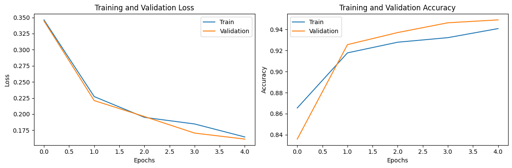

**Figure 27:** Training and validation loss and accuracy for 5 epoch ID 1

In the next variation the batch size and epochs were both increased. The validation and training loss from figure 27 indicated improvements could still be made in generalisation from increased training. This model of 10 epochs scored 0.9674 on the test data and the training and validation graphs are shown in figure 28 and already show overfitting from epoch 9. To validate this the same model was then trained across 15 epochs (ID 3) and this performed worse than the base model scoring 0.9286 on the test score indicating that the model has lost generalisation through too much training. When only training for 8 epochs as shown in ID 4, the generalisation was still worse than for ID 2. Scoring 0.9475 compared to 0.9674.

ID 5 resorted back to 10 epochs and tested the use of SGD for the optimiser and Hinge for the loss function. These changes performed below the base model. The last two model variations shown in the table as ID 6 and 7 tested a reduced learning rate and increased batch size respectively. Both failed to outperform ID 2 in generalising over the test data.

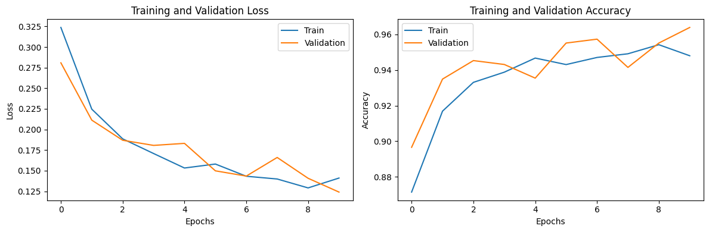

**Figure 28:** Training and validation loss and accuracy for ID 2 showing overfitting on the last epochs

| Identifying number | Optimiser | Loss function | Epochs | Batch size | Learning rate | Test score | Model change |
|----|----|----|----|----|----|----|----|
| 1 | Adam | Cross Entropy | 5 | 16 | 0.001 | 0.9317 | Base model |
| 2 | Adam | Cross Entropy | 10 | 32 | 0.001 | 0.9674 | Increased batch size and epochs |
| 3 | Adam | Cross Entropy | 15 | 32 | 0.001 | 0.9286 | Increased epochs |
| 4 | Adam | Cross Entropy | 8 | 32 | 0.001 | 0.9475 | Reduced epochs |
| 5 | SGD | Hinge | 10 | 32 | 0.001 | 0.9086 | Change in optimiser and loss function as well as reduced batch number |
| 6 | Adam | Cross Entropy | 10 | 32 | 0.0001 | 0.9002 | Reduced learning rate |
| 7 | Adam | Cross Entropy | 10 | 48 | 0.001 | 0.9412 | Increased batch size |

**Table 10:** Results from the various trainings of the ResNet-18 model in which hyperparameters are altered

### 5.3 Discussion

A high success rate produced by the models is not necessarily indicative of having produced useful convolutional neural networks. It is possible that the model has been trained to differentiate a sick fish model from a real healthy fish and that these CNNs are not usable in the detection of disease in real fish. From the start of the design process of the tilapia models there has been a close collaboration with Gårdsfisk to ensure models are produced that are as realistic as possible using 3d printers, reference pictures and continuous feedback from the farm to produce high fidelity fish. One method to combat this potential bias in the data was implemented. This took the form of using two different sick fish models so that a CNN does not become adept at solely differentiating a single model fish from a school of healthy fish.

It is, however, still entirely possible that the CNNs have become honed to differentiate a fish model from a real fish and this can be a focus for future research. A robustness test that could be performed in future research includes painting over the used models after initial data collection to ensure they are no longer representative of sick fish, but instead healthy. Then data can be collected on these healthy models and added to the healthy tilapia fish pool. This would help the model generalise on the factors that make a tilapia fish sick rather than a CNN that differentiates model fish versus real fish.

A further improvement in robustness can be achieved through the inclusion in the test training data of pictures of real diseased Nile tilapia. The main issue with this improvement is that farms are extremely unlikely to admit to having diseases present on their location for fear of reputation damage.

A major improvement for the generalisation capabilities could be seen by nncreasing the volume of good quality training data. Fish cages go through a lot of variation in water quality, cloud cover and sun intensity during a season. it can be a significant benefit to collect data that represents more variations in habitat.

Image sharpening techniques successfully employed by Deep and Dash (2019) in the identification of fish could be a useful data augmentation technique to employ. Especially when images of live tilapia are used in different conditions, this augmentation technique could improve model performance.

Lastly the hyperparameter testing in this thesis is done manually and with intuition. An improvement could be seen in the use of automated hyperparameter testing that would allow for a greater degree of finetuning in future research.

Overall, the models showcase a strong ability to correctly classify whether a diseased fish model is present in a given picture. For implementation in a real farm the self-trained CNN is the better choice with a better ability to generalise over not-seen-before images. Furthermore, the image size of 1120px by 630px with 24 bits of colour depth and no compression has an individual image size of approximately 0.202 MB. The World Economic Forum puts the range of mobile internet in Africa, one of the largest producing continents for Nile tilapia, at between 1.55mbps and 14.84mbps. A cloud hosted model with a camera architecture that uploads images using mobile data would be feasible given the data choices made.

## 6. Conclusion

The aim of this paper was to create real time early disease identification algorithms for detecting the presence of Streptococcosis and Tilapia Lake Virus (TiLV) in Nile tilapia. Due to the remote and rural nature of these farms, care was taken to build a solution that could work effectively in the intended areas. On top of this, a novel approach to data collection was used. Working closely together with Gårdsfisk for continuous feedback, a Nile tilapia farm located in Sweden, this paper designed 3D models, which were then 3D printed and painted to simulate the diseased red strain Nile tilapia.

Data for this thesis was collected personally at Gårdsfisk over the course of a week. Datasets for both healthy and diseased fish were collected. Data augmentation techniques including brightness adjustments, horizontal flip, zoom, cut-out and saturation to train more robust models. This data was used to train a purpose designed CNN as well as in a transfer learning for a ResNet-18 model. The self-trained CNN was the best performer achieving test results of 99.7%. The ResNet-18 model only achieved a test accuracy result of 96%. Both models were trained on an image resolution approximately of 1120px by 630px. The model accuracy alongside the individual image size used paves the way for farms to adopt this solution and replace an error prone manual process. The time to first detection will also see significant improvements. Using the diseased model, fish farms would also be able to create custom datasets and have custom implementations of the algorithm without the risk to their reputation and economic harm that having real sick fish could bring. This lowers the barrier to implementing this solution as well as increases the effectiveness of the results. This

There are several research limitations that would benefit from further exploration in future research. The main limitation is the risk of having trained an algorithm to detect sick model fish, rather than sick fish. Though care was taken to work closely with an established Nile tilapia farm to simulate diseased fish to the best extent possible, it is still possible that a model was trained only to detect diseased models. Future research could build a test dataset using real diseased fish; however, this is difficult due to the stigma and economic risk farms face with the presence of disease. More likely would be the inclusion of model fish in the healthy dataset to ensure the model learns the diseased characteristics rather than the model characteristics.

This thesis focused solely on red strain Nile tilapia of approximately 8 cm in size. Future research can also look at predicting disease presence in smaller or larger fish. Predicting disease presence in smaller and therefore younger fish would allow even earlier detection of disease presence where mortality rates are often even higher. 3D models for both smaller and larger fish sizes were developed as part of this thesis paving the way for this research in the future.

Lastly, future research can also include behavioural factors in disease detection. Diseased fish alter their behaviour which is often noticeable before visual symptoms are present. This could be implemented to increase the robustness of disease detection as well as create algorithms that detect disease at an earlier stage.

The main contributions from this research include a dataset of around 10,000 total red strain Nile tilapia images, 3D models of Nile tilapia ranging in size from a baby model at 1 cm to fully grown model adult at 42 cm (with every stage in between) as well as an algorithm that can predict with 99% accuracy whether a Nile tilapia suffers from either Streptococcosis or TiLV. Though further research can lead to significant improvements and robustness, enough of a platform is built to open farms up to replacing a current error prone manual process in a way that does no reputational or economic harm to the company.

This developed technology gained momentum in August of 2023 where I was invited by the largest Nile tilapia producer in Zambia to spend two weeks at their facilities working on field-testing the 3D-model trained CNN. This farm produces upwards of 15 million fish yearly for the Zambian market. Through an early detection system the security of their food production can be improved.

Through this research the food security of one of the most farmed fish in the world stands to benefit significantly, positively impacting the lives and livelihoods of people around the world and opening the doors for an iterative research process to produce even better results.

## Bibliography

> Amidi, A. and Amidi, S. (no date) *The evolution of image classification explained*, *The evolution of Image Classification explained*. Available at: https://stanford.edu/~shervine/blog/evolution-image-classification-explained (Accessed: 26 May 2023).
>
> Bhatt, D. *et al.* (2021) ‘CNN variants for Computer Vision: History, architecture, application, challenges and future scope’, *Electronics*, 10(20), p. 2470. doi:10.3390/electronics10202470.
>
> Brownlee, J. (2019) *A gentle introduction to pooling layers for Convolutional Neural Networks*, *MachineLearningMastery.com*. Available at: https://machinelearningmastery.com/pooling-layers-for-convolutional-neural-networks/ (Accessed: 26 May 2023).
>
> Chen, M. *et al.* (2012) ‘PCR detection and PFGE genotype analyses of streptococcal clinical isolates from tilapia in China’, *Veterinary Microbiology*, 159(3–4), pp. 526–530. doi:10.1016/j.vetmic.2012.04.035.
>
> Cui, S. *et al.* (2020) ‘Fish detection using Deep Learning’, *Applied Computational Intelligence and Soft Computing*, 2020, pp. 1–13. doi:10.1155/2020/3738108.
>
> Dai, J., He, K. and Sun, J. (2016) ‘Instance-aware semantic segmentation via multi-task network cascades’, *2016 IEEE Conference on Computer Vision and Pattern Recognition (CVPR)* \[Preprint\]. doi:10.1109/cvpr.2016.343.
>
> Dang, K. (2023) *Deep Learning: Computer Vision Using Transfer Learning (resnet-18) in Pytorch - skin cancer...*, *Medium*. Available at: https://medium.com/@kirudang/deep-learning-computer-vision-using-transfer-learning-resnet-18-in-pytorch-skin-cancer-8d5b158893c5 (Accessed: 30 August 2023).
>
> Darwish, A.M. *et al.* (2020) *Study shows oxytetracycline controls streptococcus in tilapia - responsible seafood advocate*, *Global Seafood Alliance*. Available at: https://www.globalseafood.org/advocate/study-shows-oxytetracycline-controls-streptococcus-in-tilapia/ (Accessed: 26 May 2023).
>
> *Deep Convolutional Neural Networks (alexnet)* (no date) *Dive into deep learning*. Available at: https://d2l.ai/chapter_convolutional-modern/alexnet.html (Accessed: 26 May 2023).
>
> Deep, B.V. and Dash, R. (2019) ‘Underwater fish species recognition using deep learning techniques’, *2019 6th International Conference on Signal Processing and Integrated Networks (SPIN)* \[Preprint\]. doi:10.1109/spin.2019.8711657.
>
> El-Sayed, A.-F.M. (2020) *Tilapia culture: Second edition*. Academic Press.
>
> Eyngor, M. *et al.* (2014) ‘Identification of a novel RNA virus lethal to tilapia’, *Journal of Clinical Microbiology*, 52(12), pp. 4137–4146. doi:10.1128/jcm.00827-14.
>
> Fathi, M. *et al.* (2017) ‘Identification of tilapia lake virus in Egypt in Nile tilapia affected by “summer mortality” syndrome’, *Aquaculture*, 473, pp. 430–432. doi:10.1016/j.aquaculture.2017.03.014.
>
> Fernandes, A.F. *et al.* (2019) ‘PSII-6 deep learning image segmentation for extraction of body measurements and prediction of body weight in Nile tilapia’, *Journal of Animal Science*, 97(Supplement_3), pp. 236–237. doi:10.1093/jas/skz258.480.
>
> Fouad, M.M. *et al.* (2013) ‘Automatic Nile tilapia fish classification approach using machine learning techniques’, *13th International Conference on Hybrid Intelligent Systems (HIS 2013)* \[Preprint\]. doi:10.1109/his.2013.6920477.
>
> Fyfe, C. and Baddeley, R. (1995) ‘Non-linear data structure extraction using simple Hebbian Networks’, *Biological Cybernetics*, 72(6), pp. 533–541. doi:10.1007/bf00199896.
>
> Girshick, R. *et al.* (2014) ‘Rich feature hierarchies for accurate object detection and semantic segmentation’, *2014 IEEE Conference on Computer Vision and Pattern Recognition* \[Preprint\]. doi:10.1109/cvpr.2014.81.
>
> Goodhill, G.J. and Barrow, H.G. (1994) ‘The role of weight normalization in competitive learning’, *Neural Computation*, 6(2), pp. 255–269. doi:10.1162/neco.1994.6.2.255.
>
> Grigory Serebryakov (Xperience.AI) Satya Mallick, (Xperience.AI), G.S. and Mallick, S. (2023) *Fully convolutional network for image classification on Arbitrary sized image*, *LearnOpenCV*. Available at: https://learnopencv.com/fully-convolutional-image-classification-on-arbitrary-sized-image/#:~:text=Convolutional%20Neural%20Networks%20Do%20Not%20Need%20Fixed%20Sized%20Input&text=Non%2Dsquare%20aspect%20ratio%20%3A%20Usually,are%20trained%20on%20square%20images (Accessed: 26 May 2023).
>
> Hancock, P.J., Baddeley, R.J. and Smith, L.S. (1992) ‘The principal components of natural images’, *Network: Computation in Neural Systems*, 3(1), pp. 61–70. doi:10.1088/0954-898x_3_1_008.
>
> Harvey, E. and Shortis, M. (1995) ‘A system for stereo-video measurement of sub-tidal organisms’, *Marine Technology Society Journal 29(4):10-22* \[Preprint\].
>
> He, K. *et al.* (2016) ‘Deep residual learning for image recognition’, *2016 IEEE Conference on Computer Vision and Pattern Recognition (CVPR)* \[Preprint\]. doi:10.1109/cvpr.2016.90.
>
> Hernandez, R.M. and Hernandez, A.A. (2019) ‘Classification of Nile tilapia using convolutional neural network’, *2019 IEEE 9th International Conference on System Engineering and Technology (ICSET)* \[Preprint\]. doi:10.1109/icsengt.2019.8906453.
>
> Hinton, G.E. *et al.* (2012) *Improving neural networks by preventing co-adaptation of feature detectors*, *arXiv.org*. Available at: https://arxiv.org/abs/1207.0580 (Accessed: 26 May 2023).
>
> Ioffe, S. and Szegedy, C., 2015, June. *Batch normalization: Accelerating deep network training by reducing internal covariate shift*. In International conference on machine learning (pp. 448-456). pmlr.
>
> Jin, L. and Liang, H. (2017) ‘Deep learning for underwater image recognition in small sample size situations’, *OCEANS 2017 - Aberdeen* \[Preprint\]. doi:10.1109/oceanse.2017.8084645.
>
> Kaliba, A.R. *et al.* (2006) ‘Economic Analysis of Nile tilapia (Oreochromis niloticus) production in Tanzania’, *Journal of the World Aquaculture Society*, 37(4), pp. 464–473. doi:10.1111/j.1749-7345.2006.00059.x.
>
> Kaur, G. *et al.* (2023) ‘Recent advancements in deep learning frameworks for precision fish farming opportunities, challenges, and applications’, *Journal of Food Quality*, 2023, pp. 1–11. doi:10.1155/2023/4399512.
>
> Kayansamruaj, P. *et al.* (2014) ‘Increasing of temperature induces pathogenicity of streptococcus agalactiae and the up-regulation of inflammatory related genes in infected Nile tilapia (Oreochromis niloticus)’, *Veterinary Microbiology*, 172(1–2), pp. 265–271. doi:10.1016/j.vetmic.2014.04.013.
>
> Klesius, P.H., Shoemaker, C.A., Evans, J.J. 2008. *Streptococcus: a worldwide fish health problem*. Proceedings from the 8th International Symposium on Tilapia in Aquaculture. Cairo, Egypt October 12-14, 2008. Volume 1: p 83-107.
>
> Krizhevsky, A., Sutskever, I. and Hinton, G.E. (2017) ‘ImageNet classification with deep convolutional Neural Networks’, *Communications of the ACM*, 60(6), pp. 84–90. doi:10.1145/3065386.
>
> Lowe, D.G. (2004) ‘Distinctive image features from scale-invariant keypoints’, *International Journal of Computer Vision*, 60(2), pp. 91–110. doi:10.1023/b:visi.0000029664.99615.94.
>
> Mai, T.T. *et al.* (2022) ‘Immunization of nile tilapia (oreochromis niloticus) broodstock with Tilapia Lake virus (tilv) inactivated vaccines elicits protective antibody and passive maternal antibody transfer’, *Vaccines*, 10(2). doi:10.20944/preprints202201.0015.v1.
>
> Miao, W. (2020) ‘Trends of aquaculture production and trade: Carp, tilapia, and shrimp’, *Asian Fisheries Science*, 33S. doi:10.33997/j.afs.2020.33.s1.001.
>
> Olshausen, B.A. and Field, D.J. (1996) ‘Emergence of simple-cell receptive field properties by learning a sparse code for natural images’, *Nature*, 381(6583), pp. 607–609. doi:10.1038/381607a0.
>
> Oviedo-Bolaños, K. *et al.* (2021) ‘Molecular identification of streptococcus sp. and antibiotic resistance genes present in tilapia farms (Oreochromis niloticus) from the Northern Pacific Region, Costa Rica’, *Aquaculture International*, 29(5), pp. 2337–2355. doi:10.1007/s10499-021-00751-0.
>
> Rathi, D., Jain, S. and Indu, S. (2017) ‘Underwater fish species classification using convolutional neural network and Deep Learning’, *2017 Ninth International Conference on Advances in Pattern Recognition (ICAPR)* \[Preprint\]. doi:10.1109/icapr.2017.8593044.
>
> Rao, M. *et al.* (2021) ‘Microbiological investigation of Tilapia Lake virus–associated mortalities in cage-farmed Oreochromis Niloticus in India’, *Aquaculture International*, 29(2), pp. 511–526. doi:10.1007/s10499-020-00635-9.
>
> Rayan, Muhammad & Rahim, Abdur & Rahman, Abir & Marjan, Md & Ali, U A Md Ehsan. (2021). Fish Freshness Classification Using Combined Deep Learning Model. 10.1109/ACMI53878.2021.9528138.
>
> Rumelhart, D.E. and Zipser, D. (1985) ‘Feature Discovery by competitive learning\*’, *Cognitive Science*, 9(1), pp. 75–112. doi:10.1207/s15516709cog0901_5.
>
> Salman, A. *et al.* (2016) ‘Fish species classification in unconstrained underwater environments based on Deep Learning’, *Limnology and Oceanography: Methods*, 14(9), pp. 570–585. doi:10.1002/lom3.10113.
>
> Sanger, T.D. (1989) ‘Optimal unsupervised learning in a single-layer linear feedforward neural network’, *Neural Networks*, 2(6), pp. 459–473. doi:10.1016/0893-6080(89)90044-0.
>
> Siddik, M.A. *et al.* (2014) ‘Over-wintering growth performance of mixed-sex and mono-sex Nile tilapia Oreochromis niloticus in the northeastern Bangladesh’, *Croatian Journal of Fisheries*, 72(2), pp. 70–76. doi:10.14798/72.2.722.
>
> Simonyan, K. and Zisserman, A. (2015) *Very deep convolutional networks for large-scale image recognition*, *arXiv.org*. Available at: https://arxiv.org/abs/1409.1556 (Accessed: 26 May 2023).
>
> Sivic and Zisserman (2003) ‘Video google: A text retrieval approach to object matching in videos’, *Proceedings Ninth IEEE International Conference on Computer Vision* \[Preprint\]. doi:10.1109/iccv.2003.1238663.
>
> Storbeck, F. and Daan, B. (2001) ‘Fish species recognition using computer vision and a neural network’, *Fisheries Research*, 51(1), pp. 11–15. doi:10.1016/s0165-7836(00)00254-x.
>
> Strachan, N. (1995) ‘A potential method for the differentiation between haddock fish stocks by computer vision using canonical discriminant analysis’, *ICES Journal of Marine Science*, 52(1), pp. 145–149. doi:10.1016/1054-3139(95)80023-9.
>
> Tengtrairat, N. *et al.* (2022) ‘Non-intrusive fish weight estimation in turbid water using deep learning and Regression Models’, *Sensors*, 22(14), p. 5161. doi:10.3390/s22145161.
>
> *Tilapia lake virus (TiLV) disease* (no date) *https://www.agriculture.gov.au/*. Available at: https://www.agriculture.gov.au/sites/default/files/documents/tilapia_lake_virus_disease.pdf (Accessed: 25 May 2023).
>
> Wei, J. (2020) *Alexnet: The architecture that challenged CNNs*, *AlexNet: The Architecture that Challenged CNNs*. Available at: https://towardsdatascience.com/alexnet-the-architecture-that-challenged-cnns-e406d5297951 (Accessed: 26 May 2023).
>
> Zhang, Z. (2021) ‘Research advances on tilapia streptococcosis’, *Pathogens*, 10(5), p. 558. doi:10.3390/pathogens10050558.

## Appendix D: Code

The code for this thesis, with commentary, is in [`notebook.ipynb`](notebook.ipynb).
